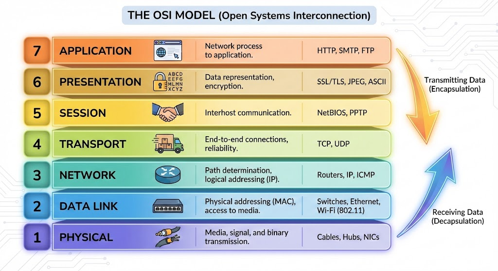

# Session 01: Introduction to Networking & The OSI Model

## 1. What is a Computer Network?
In the simplest terms, a **network** consists of two or more computers (or other electronic devices) that are connected together for the purpose of sharing resources and communication.

However, a more technical definition requires four specific elements:
1.  **Sender:** The device originating the data.
2.  **Receiver:** The device intended to get the data.
3.  **Medium:** The path the data takes (Copper wire, Fiber optic glass, Air/Radio waves).
4.  **Protocol:** The set of rules that governs *how* the data is sent.

> **Analogy:** Think of a network like a conversation. You (Sender) speak to a friend (Receiver) through the air (Medium). But for the conversation to work, you must both speak the same language (Protocol). If one speaks Persian and the other speaks French, the network exists, but communication fails.

---

## 2. The Logic of Layering (Abstraction)
Networking is complex. To make it manageable, engineers use a concept called **Layering**.

### Why do we layer?
1.  **Independence:** Each layer has a specific job and doesn't care how the other layers do theirs.
    * *Example:* A web browser (Software Layer) doesn't care if you are using Wi-Fi or a LAN cable (Physical Layer). It sends the data the same way.
2.  **Troubleshooting:** It makes it easier to isolate problems. If your internet is down, you check the cable first (Layer 1). If the cable is fine, you check the IP configuration (Layer 3).
3.  **Interoperability:** Different vendors (Cisco, Juniper, Microsoft) can build products that work together because they all follow the same layer standards.

---

## 3. The OSI Model (Open Systems Interconnection)
The **OSI Model** is the universal standard for how computer networks communicate. It divides the communication process into **7 distinct layers**.

While the model has 7 layers, this course focuses heavily on the **Hardware/Infrastructure Layers (1-3)**, as these are the physical foundations of the network.

### Layer 1: The Physical Layer
* **Function:** Transmission of raw data over a physical medium.
* **What it does:** It converts digital data (1s and 0s) into electrical, optical, or radio signals.
* **Key Question:** *"How do I physically cable this?"*
* **Data Unit:** **Bits**
* **Devices:** Hubs, Repeaters, Cables (Ethernet, Fiber), Network Interface Cards (NICs).
* **Troubleshooting:** Is the cable plugged in? Is the light on the port green?

### Layer 2: The Data Link Layer
* **Function:** Node-to-node data transfer. It ensures data is transferred error-free between two directly connected devices.
* **What it does:** It packages the raw bits from Layer 1 into organized blocks called "Frames." It uses **Physical Addressing (MAC Addresses)** to identify devices.
* **Key Question:** *"How do I move data across the immediate infrastructure?"*
* **Data Unit:** **Frames**
* **Devices:** **Switches**, Bridges.
* **Note:** This layer is responsible for "Physical Addressing" (MAC Address), which is burned into the network card hardware.

### Layer 3: The Network Layer
* **Function:** Routing and Global Addressing.
* **What it does:** It determines the best path for data to travel across different networks (e.g., from your house to a server in another country). It uses **Logical Addressing (IP Addresses)**.
* **Key Question:** *"How do I get from this system to a different system?"*
* **Data Unit:** **Packets**
* **Devices:** **Routers**, Layer 3 Switches.
* **Note:** This layer connects different networks together (Inter-networking).

---

## 4. Summary of Data Units (PDU)
A common interview question is "What is the data called at Layer X?"

| Layer | Name | Data Unit (PDU) | Hardware |
| :--- | :--- | :--- | :--- |
| **Layer 3** | **Network** | **Packet** | Router |
| **Layer 2** | **Data Link** | **Frame** | Switch |
| **Layer 1** | **Physical** | **Bit** | Cable / Hub |

---

## 5. Encapsulation (The Envelope Analogy)
Data moves down the layers like putting a letter in envelopes.
1.  **Application:** You write the letter.
2.  **Layer 3 (Network):** You put the letter in an envelope and write the destination address (IP Address).
3.  **Layer 2 (Data Link):** The mailman puts your envelope into a sorting bin (Frame) to go to the local post office.
4.  **Layer 1 (Physical):** The truck drives the bin down the road (Cables).

When the data arrives at the other side, the process is reversed (**Decapsulation**).
