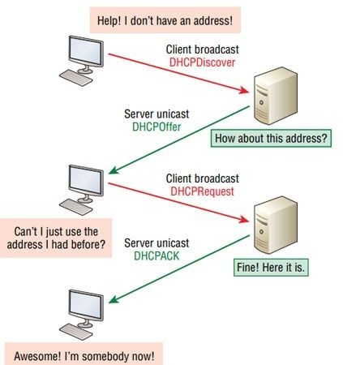

# Session 03: DHCP & Dynamic Addressing

## 1. The Problem: Static vs. Dynamic

In the previous session, we manually typed IP addresses into our devices. This is called **Static Addressing**.

-   **Pros:** Good for servers/printers that shouldn't change.
    
-   **Cons:** A nightmare for 100+ computers. If you make a typo (duplicate IP), the network breaks.
    

**The Solution:** **DHCP** (Dynamic Host Configuration Protocol). DHCP is a server that automatically hands out IPs, Subnet Masks, Gateways, and DNS settings to devices when they join the network.

> **🏨 Analogy:**
> 
> -   **Static:** You own a specific reserved parking spot. No one else can park there.
>     
> -   **Dynamic (DHCP):** Valet parking. You arrive, the valet gives you a ticket (IP) for a spot. When you leave, that spot is given to someone else.
>     

---

## 2. Core Concepts: Transmission & Transport

To understand DHCP, we must first understand two underlying concepts: **Transmission Modes** and **Transport Protocols**.

### A. Broadcast vs. Unicast

|Type|Description|Analogy|
|---|---|---|
|**Unicast**| One-to-One communication. Specific Source to Specific Destination. |A private phone call between two people.|
|**Broadcast** | One-to-All communication. One sender, everyone on the network receives it.| A teacher speaking to the whole classroom via a loudspeaker.|

-   **Why does this matter?** When a computer first wakes up, it has **No IP Address**. It doesn't know where the server is. So, it _must_ use **Broadcast** to shout for help.

### B. TCP vs. UDP

Data travels inside "Transport Layer" protocols. The two main ones are:

|Feature| TCP (Transmission Control Protocol) |UDP (User Datagram Protocol)|
|---|---|---|
|**Reliability**| **High.** Guarantees delivery. If a packet is lost, it resends it. | **Low.** Fire and forget. No guarantee.|
|**Speed** | Slower (due to checking). | Faster (low overhead).|
|**Connection**|  Connection-Oriented (3-Way Handshake).| Connection-less.|
|**Usage**| Web browsing (HTTP), Email, File Transfers. | Streaming, Gaming, **DHCP**, DNS.|

-   **DHCP uses UDP** (Port 67 for Server, Port 68 for Client).
    
-   _Why UDP?_ The client doesn't have an IP yet to form a complex TCP connection. It just needs to broadcast a simple message quickly.
    
---

## 3. The DHCP Process (DORA)

How does a client get an IP? The process involves 4 steps, remembered by the acronym **DORA**.



### Step 1: **D**iscovery (Client -> Server)

-   **Action:** The client wakes up with no IP (`0.0.0.0`). It shouts to the whole network.
    
-   **Message:** "Is there any DHCP server out there? I need an IP!"
    
-   **Type:** **Broadcast** (Dest: `255.255.255.255`).
    
-   **Protocol:** UDP.
    

### Step 2: **O**ffer (Server -> Client)

-   **Action:** The DHCP Server hears the shout. It checks its pool of available IPs.
    
-   **Message:** "Hello! I am a server. I can offer you IP `192.168.1.50`."
    
-   **Type:** Unicast (usually) or Broadcast (depending on OS).
    

### Step 3: **R**equest (Client -> Server)

-   **Action:** The client accepts the offer.
    
-   **Message:** "Great! I would formally like to request `192.168.1.50`."
    
-   **Type:** **Broadcast**.
    
-   _Why Broadcast?_ To tell _other_ DHCP servers (if they exist): "I accepted this guy's offer, you can release your offers now."
    

### Step 4: **A**cknowledge (Server -> Client)

-   **Action:** The server finalizes the deal.
    
-   **Message:** "Confirmed. `192.168.1.50` is yours for 24 hours. Here is your Map (Gateway) and Phonebook (DNS)."
    
-   **Type:** Unicast.
    

---

## 4. Wireshark Analysis: The DORA Exchange

Here is a breakdown of what each packet looks like when capturing traffic on port 67/68.

### Packet 1: Discovery (The Shout)
The client is looking for a server.

|Field | Value | Explanation |
|---|---|---|
|**Source IP**| `0.0.0.0` | "I don't have an identity yet."|
|**Dest IP** | `0.0.0.0` | Broadcast (Everyone listen!).|
|**Option 53** | Discovery (1) | The Message Type."|
|**Client MAC** | `aa:bb:cc...` |The physical address of the requester.|

### Packet 2: Offer (The Proposal)
The server proposes an IP.

|Field | Value | Explanation |
|---|---|---|
|**Source IP**| `192.168.1.1` | The Server's IP.|
|**Dest IP** | `255.255.255.255` | Broadcast (Since client has no IP yet).|
|**Your (Client) IP** | `192.168.1.50` | The field yiaddr. "Here is an IP you can use."|
|**Option 53** | Offer (2) | The Message Type."|
|**Option 1**| `255.255.255.0 `| Subnet Mask. |
|**Option 3**| `192.168.1.1`|Router (Gateway).|
|**Option 6**| `8.8.8.8` |DNS Server.|
|**Client MAC** | `aa:bb:cc...` |The physical address of the requester.|

### Packet 3: Request (The Selection)
The client formally requests that specific IP.

|Field | Value | Explanation |
|---|---|---|
|**Source IP**| `0.0.0.0` | Still 0.0.0.0 (Client hasn't officially claimed it yet).|
|**Dest IP** | `255.255.255.255` | Broadcast (To tell other servers to back off).|
|**Your (Client) IP** | `192.168.1.50` | The field yiaddr. "Here is an IP you can use."|
|**Option 53** | Request (3) | The Message Type."|
|**Option 50**| `192.168.1.50` | "Requested IP Address". |
|**Option 54**| `192.168.1.1` | "DHCP Server Identifier" (Targeting the specific server).|

### Packet 4: Acknowledge (The Handshake)
The server confirms the lease. The client can now use the IP.

|Field | Value | Explanation |
|---|---|---|
|**Source IP**| `192.168.1.1` | The Server.|
|**Dest IP** | `255.255.255.255` | Broadcast (or Unicast).|
|**Option 53** | ACK (5) | The Message Type.|
|**Option 51**| 600 | IP Address Lease Time (10 minutes). |


### 📋 Common DHCP Options Reference

DHCP uses numbered "Options" to pass extra information. Here are the most critical ones you will see in Wireshark:

|Option #| Name | Description|
|---|---|---|
| 53 |Message Type | Identifies the packet: 1=Discovery, 2=Offer, 3=Request, 5=ACK.|
| 50 |Requested IP |  Used by the client to ask for a specific IP address.|
| 51 | Lease Time |  How long (in seconds) the IP is valid before renewal is needed. |
| 54 | Server Identifier |  The IP of the DHCP server. Essential when multiple servers exist.|
| 1 | Subnet Mask | Tells the client the size of the network (e.g., 255.255.255.0).|
| 3 | Router | The Default Gateway IP (to reach the Internet). |
| 6 | DNS Server | The server used to resolve names (like google.com to an IP).|
| 12 | Host Name | The name of the client device (e.g., "Johns-MacBook").|
    
## 5. Lab: Setting up `isc-dhcp-server` on Linux

In this lab, we turn an Ubuntu machine into a DHCP Server.

### Installation

```
sudo apt update
sudo apt install isc-dhcp-server

```

### Configuration Step 1: Select Interface

We need to tell the server _which_ network card to listen on (e.g., `eth0`). **File:** `/etc/default/isc-dhcp-server`

```
# On what interfaces should the DHCP server (dhcpd) serve DHCP requests?
INTERFACESv4="eth0"

```

### Configuration Step 2: Define the Subnet

We configure the IP range and options. **File:** `/etc/dhcp/dhcpd.conf`

```
# Define the Subnet
subnet 192.168.1.0 netmask 255.255.255.0 {
    
    # The pool of IPs to hand out (Range)
    range 192.168.1.100 192.168.1.200;
    
    # Standard Options
    option routers 192.168.1.1;           # The Gateway
    option domain-name-servers 8.8.8.8;   # DNS (Google)
    
    # Lease Time (in seconds)
    default-lease-time 600;               # 10 Minutes
    max-lease-time 7200;
}

```

### Advanced: Static Reservation (Fixed IP)

If you want a specific printer or server to _always_ get the same IP via DHCP, you map its MAC address. Add this inside the `dhcpd.conf`:

```
host my-printer {
    hardware ethernet 00:11:22:33:44:55;  # MAC Address of device
    fixed-address 192.168.1.50;           # Reserved IP
}

```

### Apply Changes

```
sudo service isc-dhcp-server restart
sudo service isc-dhcp-server status

```

---

## 6. Managing Leases & Release

### The Lease Concept

DHCP does not give you an IP permanently. It "leases" (rents) it.

-   When half the time is up, the client tries to **Renew**.
    
-   If the lease expires and the client is gone, the IP goes back to the pool.
    

### DHCP Release

If a client wants to leave the network gracefully, it sends a **DHCP Release** packet.

-   **Command (Linux):** `sudo dhclient -r`
    
-   **Result:** The client tells the server "I am done with IP 192.168.1.50." The server immediately makes that IP available for someone else.
    
        
    4.  Server sends "Ack".
