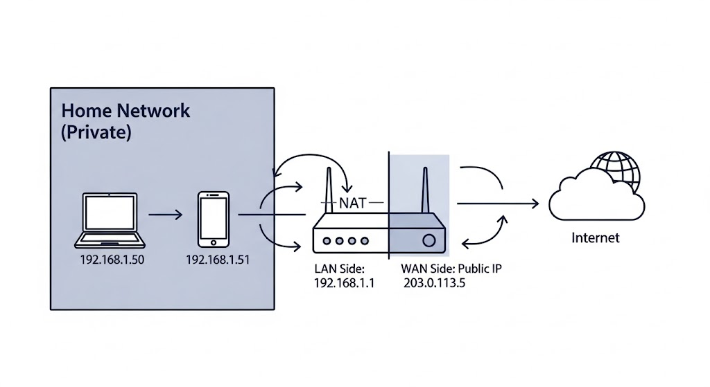

# Session 04: IP Addressing, Classes, and Subnetting

## 1. What is an IP Address?

To communicate in a network, every device needs a unique identifier. We call this the **IP Address** (Internet Protocol Address).

-   **IPv4 (Version 4):** The standard we use most today. It is a **32-bit** number.
    
-   **The Problem:** 32 bits gives us about **4.3 Billion** addresses ($2^{32}$). With mobile phones and IoT, we ran out of these addresses years ago.
    
-   **The Solution:** **IPv6 (Version 6)**. It uses **128 bits**, providing an almost infinite number of addresses.
    

### Structure of an IPv4 Address

An IP address looks like `192.168.1.1`. It is divided into **4 Octets** (parts), separated by dots.

-   Each "Octet" is **8 bits**.
    
-   The maximum value for 8 bits is **255** (Binary `11111111`).
    
-   Therefore, `256.10.10.10` is **Impossible**. An octet cannot be larger than 255.

    
---

## 2. Network Portion vs. Host Portion

An IP address is actually two addresses combined in one string:

1.  **Network ID:** Which "Street" or "Neighborhood" are you on?
    
2.  **Host ID:** Which specific "House" number is yours?
    

**Who decides where the split is?** The **Subnet Mask**.

### The Subnet Mask

The subnet mask tells the computer which part of the IP is the Network (Shared) and which is the Host (Unique).

**Example: `/24` or `255.255.255.0`**

-   **IP:** `192.168.1.50`
    
-   **Mask:** `255.255.255.0`
    
-   **Logic:**
    
    -   The `255`s mean "Match this exactly".
        
    -   The `0` means "This part can change".
        
-   **Result:**
    
    -   **Network:** `192.168.1` (Everyone in the office has this).
        
    -   **Host:** `.50` (Only you have this).
        

--- 

## 3. IP Address Classes (The History)

Originally, IANA (Internet Assigned Numbers Authority) divided IPs into "Classes" to make routing easier. While we use "Classless" (CIDR) routing today, knowing these is still essential.

|Class |First Octet Range |Default Mask |Intended For|
|---| --- | --- | --- |
|**Class A** |`1 - 126`| `255.0.0.0` (/8)| Huge organizations (Google, MIT). Supports 16 million hosts.|
|**Class B** |`128 - 191` | `255.255.0.0` (/16)| Medium companies. Supports 65,000 hosts.|
|**Class C** | `192 - 223` | `255.255.255.0` (/24) |  Small networks (Home, Small Office). Supports 254 hosts.|
|**Class D** |`224 - 239` |N/A | **Multicast** (Streaming video to groups).|
| **Class E** |`240 - 255` | N/A |**Experimental** / Research.|

> **Note:** Notice `127` is missing? `127.0.0.0/8` is reserved for **Loopback** (Localhost).

---

## 4. Public vs. Private IPs (RFC 1918)

Not every IP needs to be on the public internet. To save addresses, engineers created **Private Ranges**.

-   **Public IPs:** Routable on the internet. Must be purchased/leased. Unique worldwide.
    
-   **Private IPs:** NOT routable on the internet. Used inside homes/offices. Free to use.
    

**The 3 Private Ranges:**

1.  **Class A Private:** `10.0.0.0` to `10.255.255.255` (Big networks).
    
2.  **Class B Private:** `172.16.0.0` to `172.31.255.255` (Docker/Cloud often use this).
    
3.  **Class C Private:** `192.168.0.0` to `192.168.255.255` (Home routers).
    

> **Question:** If Private IPs can't go on the internet, how am I browsing the web? **Answer:** **NAT (Network Address Translation)**. Your Router takes your private IP (`192.168.1.50`), swaps it with its single Public IP, and sends the request to Google.

--- 

## 5. Subnetting & CIDR

**CIDR (Classless Inter-Domain Routing)** is the modern way to write masks using a slash `/`.

-   `/24` = 24 bits are Network = `255.255.255.0`.
    

### The "Rules of the Road"

In any specific subnet block, there are **two addresses you generally CANNOT use** for devices:

1.  **First Address (Network Address):** Identifies the network itself. (e.g., `192.168.1.0`).
    
2.  **Last Address (Broadcast Address):** Used to shout to everyone in that subnet. (e.g., `192.168.1.255`).
    

### Example: The `/25` Split

Imagine we have `192.168.1.0/24`. This gives us 256 IPs (0-255). We want to split it into **two smaller networks** (Subnets). We borrow **1 bit** from the host portion. The mask becomes `/25` (`255.255.255.128`).

**Subnet A (First Half):**

-   **Range:** `192.168.1.0` to `192.168.1.127`
    
-   **Network ID:** `192.168.1.0` (Cannot use for host)
    
-   **Broadcast ID:** `192.168.1.127` (Cannot use for host)
    
-   **Usable IPs:** `192.168.1.1` to `192.168.1.126` (Total 126).
    

**Subnet B (Second Half):**

-   **Range:** `192.168.1.128` to `192.168.1.255`
    
-   **Network ID:** `192.168.1.128`
    
-   **Broadcast ID:** `192.168.1.255`
    
-   **Usable IPs:** `192.168.1.129` to `192.168.1.254`.
    

---

## 6. Common Questions

### Why is `256.10.10.10` invalid?

Computers think in Binary (1s and 0s). An octet is **8 bits**.

-   `11111111` in binary = **255** in decimal.
    
-   To store the number 256, you would need 9 bits (`100000000`), which doesn't fit in the IPv4 structure.
    

### Why do we subnet?

1.  **Security:** Keep HR computers separate from Guest Wi-Fi.
    
2.  **Performance:** Reduce broadcast traffic (noise) on the network.
    
3.  **Organization:** easier to manage logical groups.
    
